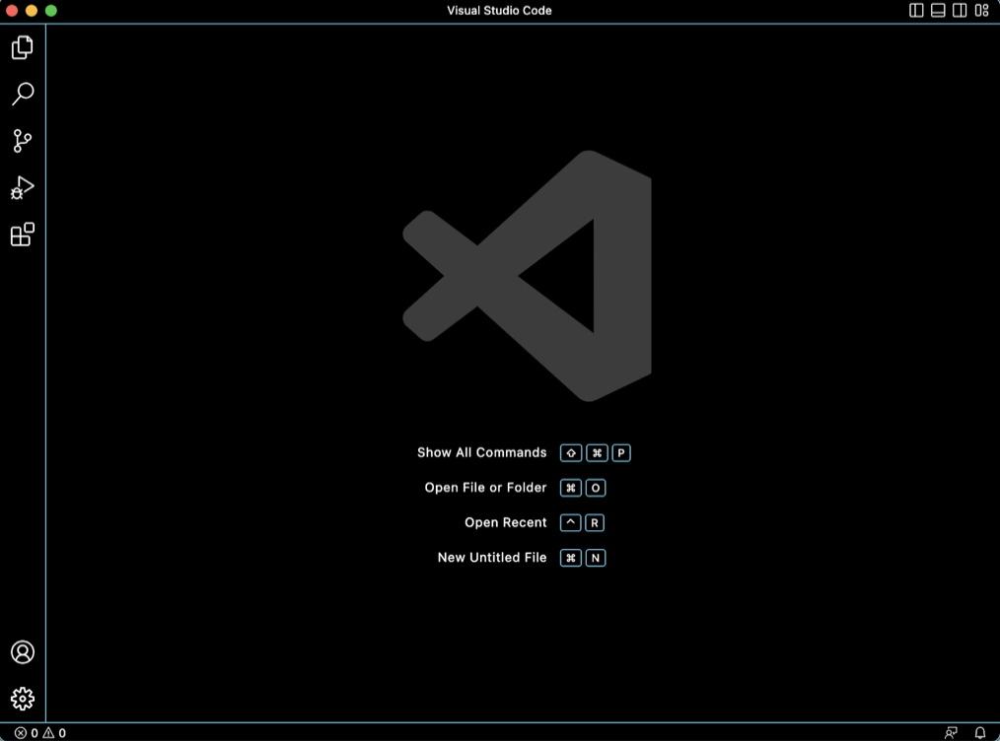
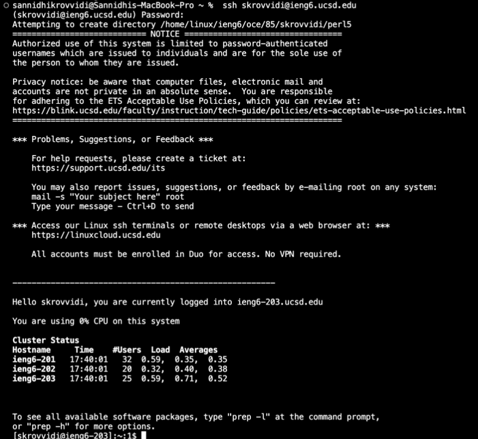
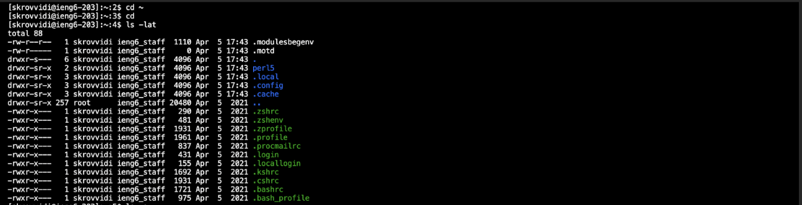
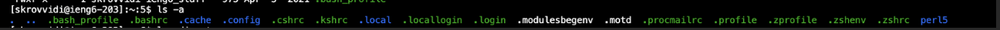

# Lab Report 1
***
Tutorial for creating a github page through remote access:
1. Download VS Code 
* The first step is download the application VS Code, or any similar interface that would allow you to remotely connect. In my case, this application was already downloaded for a previous class, so I already had completed this step. 
* However, if the application is not already downloaded, you can do so at this [Link](https://code.visualstudio.com/). This page will have step-by-step instructions to download and install VS Code on your computer. 
* There are different versions for different major operating systems such as macOS (for Macs) and Windows (for PCs). Once downloaded, the application should look like the image below. (My VS Code is in dark mode). 


2. Creating an account for remote connection that is course specific `ieng6`
* To do so one must click this [Link](https://sdacs.ucsd.edu/~icc/index.php), to look up their CSE 15L course specific account. After doing so they must reset their password using the global password tool, making sure that they are resetting their course specific account password, and not their Active Directory password. 
* They will be able to also find their CSE 15L course specific account name which will be used to remotely connect to the 15L servers. 

3. Remotely connecting 
* In order to remotely connect, if one has a mac (this was true in my case), they can directly remotely connect by running this line in the terminal:
```$ ssh cs15lsp23zz@ieng6.ucsd.edu```
Where the `zz` can be substituted with the specific letters in each course specific account. 
* In my case the course specific account did not work when I tried to remotely connect, nor did it work for any of my lab partners, so we used our normal tritonlink IDs which helped for the time being.


4. Trying some commands 
Once remotely connected, trying a series of commands can help understand the extent of this remote connection better. Some of the commands I tried below include
* `cd ~`
* `cd`
* `ls -lat`

as well as 
* `ls -a`

