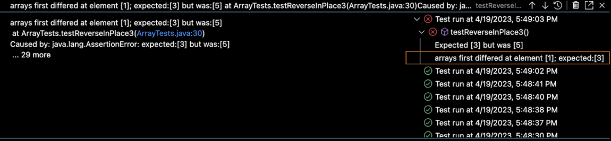

# Lab Report 2
*** 
## Part 1


*** 
## Part 2
The bug that I chose is the bug from the reversed method. 
1. failure inducing input 
```
@Test 
  public void testReversed2() {
    int[] input2 = { 1, 2, 3};
    assertArrayEquals(new int[]{3, 2, 1}, ArrayExamples.reversed(input2));
  }
```
2. input that does not induce failure
```
@Test
  public void testReversed() {
    int[] input1 = { };
    assertArrayEquals(new int[]{ }, ArrayExamples.reversed(input1));
  }
  ```
3. symptom of running the tests

4. before and after code 
before
```
  static int[] reversed(int[] arr) {
    int[] newArray = new int[arr.length];
    for(int i = 0; i < arr.length; i += 1) {
      arr[i] = newArray[arr.length - i - 1];
    }
    return arr;
  }
  ```
  after 
  ```
    static int[] reversed(int[] arr) {
    int[] newArray = new int[arr.length];
    for(int i = 0; i < arr.length / 2; i += 1) {
      int temp = arr[i];
      arr[i] = newArray[arr.length - i - 1];
      arr[arr.length - i - 1] = temp;
    }
    return temp;
  }
 ```
 Here we fixed the message by iterating through halves of the array (arr.length / 2) and also by storing the array variables in a temp variable to store the new array as arrays are immutable. 

***
## Part 3
In week 2 we conducted a lab primarily involving debugging, which I found very helpful. I have struggled with how to go about fixing issues in my code so the clarity in looking for bugs and testing our code to see where it breaks in order to make it stronger was insightful. I wouldn't have really understood how to do this before. 
