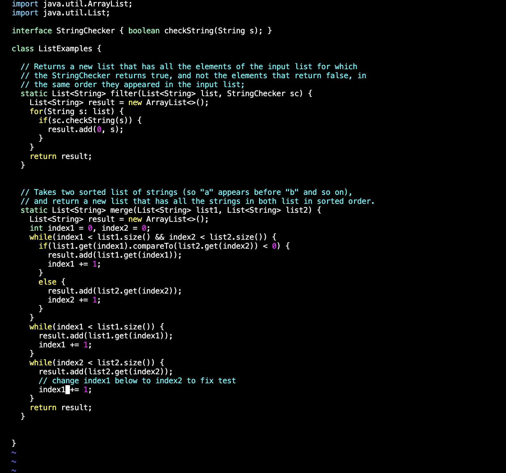
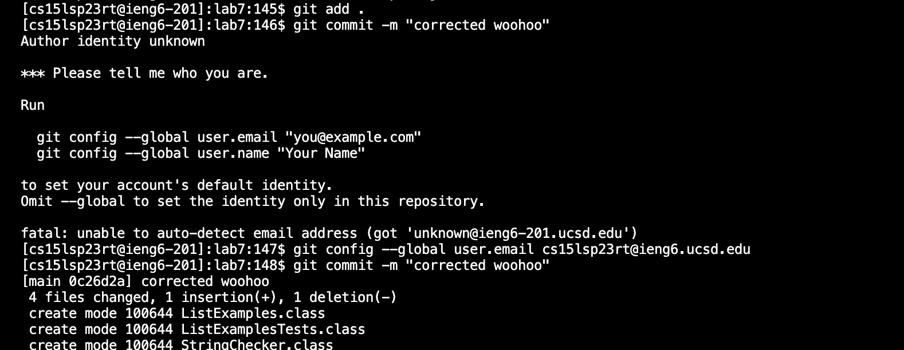

# Lab Report 4
***
## Editing from the Command Line 
1. Logging into the ieng6 account.
I set up my `ieng6` account to be able to login without entering my password, so I directly used the command
```
$ ssh cs15lsp23rt@ieng6.ucsd.edu
```


2. Cloning my fork of the repository from my Github account.
I cloned the repository straight from the command line using the clone command 
```
$ git clone https://github.com/ucsd-cse15l-s23/lab7
```


3. Running the tests, demonstrating that they fail.
I changed the directory I was in to be lab7, and then ran the bash command for the tests which was
```
$ bash test.sh
```
This ran the tests from ListExamples.java and ListExamplesTests.java and returned the results. Here we can see
that there is a failed test, likely from the error in the code. 


4. Edit the code file to fix the failing test.
I used the command for vimtutor in order to edit the file in the command line which was
```
$ vim ListExamples.java
```
I used this to edit the code in ListExamples.java from the command line. This is the code before I edited it.

Then, since I started from the bottom of the file, I navigated upwards using the command `g43 <enter>`, as the 
error in the code was in the 43rd line. At first I was navigating to this line just using a repeated series of 
`<up>` and `<right>` commands, but landed on the `g43 <enter>` command for efficiency to reach the lowest time while
fixing the code. 
To edit the code I used the command `e <enter>` and `r2 <enter>`, which took me exactly to the end of the word where the 1 in the
error was, and replaced it with 2. At first I was performing this edit using the `i <backspace> 2` insert command after 
moving to the spot of the error on the line with a series of `<right>` commands, but while practicing, found that
this was the most efficient method. Lastly, to save I pressed `esc` and then `:wq`, which saved and exited me out of 
the file. Below is the corrected code.


5. Run the tests, demonstrating that they now succeed.
Then, using the same command as before 
```
$ bash test.sh
```
I ran the tests for the ListExamples.java code. It returned the result that all tests had passed this time, 
confirming our changes.


6. Commit and push the resulting change to your Github account.
I then added the changes using the git add command
```
$ git add .
```
and after confirming my email, was able to commit them using the command
```
$ git commit -m "corrected woohoo" 
```


# Thank you!
