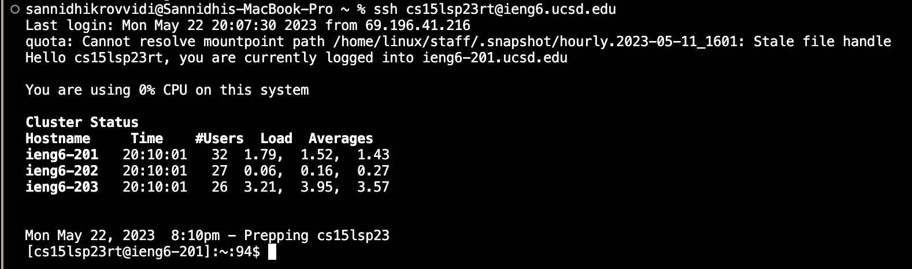
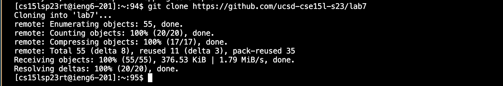
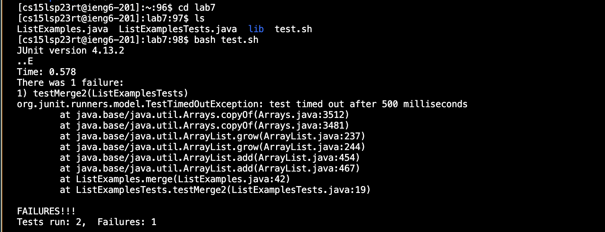
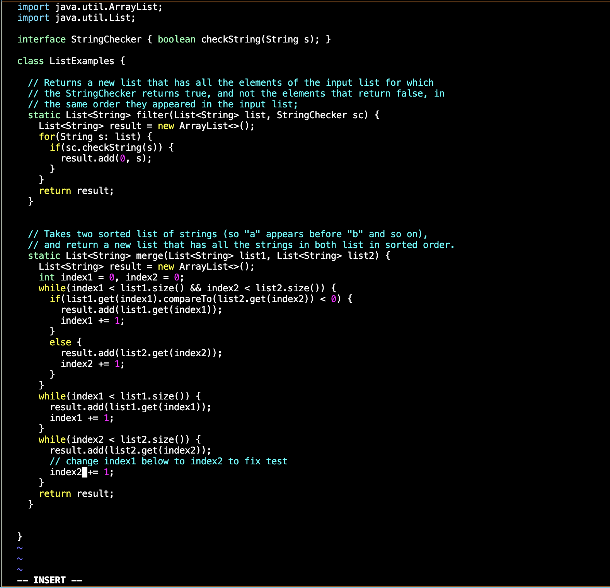
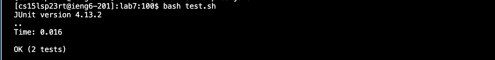

# Lab Report 4
***
## Editing from the Command Line using vimtutor
1. Logging into the ieng6 account.

2. Clone your fork of the repository from your Github account.

3. Run the tests, demonstrating that they fail.

4. Edit the code file to fix the failing test.

5. Run the tests, demonstrating that they now succeed.

6. Commit and push the resulting change to your Github account.
